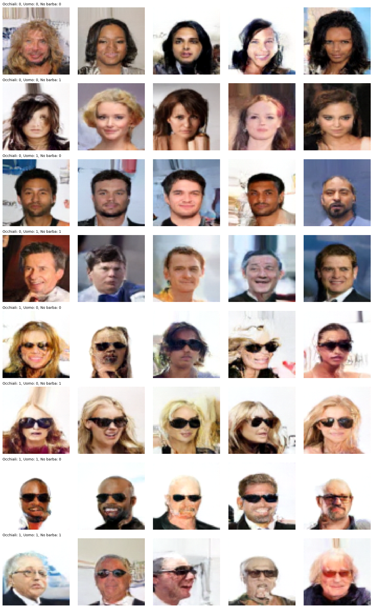

# Generative-AI  Conditional Face Generation with CelebA dataset

This repository contains experimental code (a university project) for
conditional face generation using three different approaches:

- DDPM (Denoising Diffusion Probabilistic Models)  folder `DDPM/`
- Conditional GAN (CGAN)  folder `GAN/`
- Conditional VAE (CVAE)  folder `VAE/`

Some model checkpoints (`*.pth`) are included in the repository and
can be used to generate samples without re-training the models.

Important: the scripts rely on PyTorch and may use the GPU. Running
these scripts on CPU can be very slow or impractical for full
generation/training runs.

## Repository structure

- `DDPM/`  DDPM implementation and generation script:
  - `DDPMNEW.py` (model definition), `ddpm_gen.py` (generation)
  - checkpoint: `ddp280.pth`
- `GAN/`  CGAN implementation:
  - `CGAN_newtry_c.py` (model), `GenerationGan.py` (generation)
  - checkpoint: `modelgen68.pth`
- `VAE/`  CVAE implementation:
  - `CVAE3brb.py` (training), `CVAE3brbgen.py` (generation)
- `imgs/`  example images (if present)


## Quickstart  run examples

1. Verify core libraries are available:

```powershell
python -c "import torch, torchvision, matplotlib, PIL, numpy; print('OK')"
```

2. Run one of the generation scripts (these use the included checkpoints):

DDPM example:
```
cd DDPM
python ddpm_gen.py
```

GAN example:
```
cd GAN
python GenerationGan.py
```

VAE example:
```
cd VAE
python CVAE3brbgen.py
```

The scripts display generated images with `matplotlib`. On a headless
server you should modify the scripts to save images to disk using
`plt.savefig(...)` instead of `plt.show()`.

## Dataset and paths

- The training scripts expect the CelebA dataset in local paths
  (examples: `./Data/CelebA` or other locations defined near the
  top of each script). Download CelebA and update the paths in the
  scripts if you plan to train from scratch.
- Provided checkpoints allow running generation without retraining.

## Practical notes & limitations

  `DDPM/DDPMNEW.py`, `GAN/CGAN_newtry_c.py`). If you don't have a GPU
  change these to `'cpu'` or use the pattern:

```python
device = torch.device('cuda' if torch.cuda.is_available() else 'cpu')
```

  steps where applicable!


## Example ddpm output




